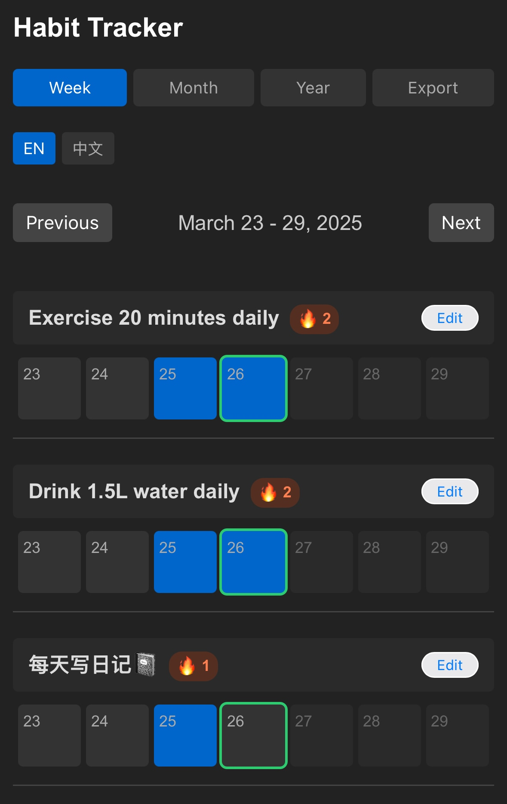

# Habit Tracker

A minimal, elegant habit tracking application for building consistent daily habits and tracking your progress over time.



## Features

- **Multiple Views**: Track your habits with week, month, and year views
- **Multilingual Support**: Switch between English and Simplified Chinese interfaces
- **Streak Tracking**: Visual indicators show your current streak for each habit
- **Milestone Celebrations**: Get notifications when you reach 7, 21, and 90-day streaks
- **Data Visualization**: Color-coded cells show your habit completion patterns
- **Export Feature**: Export your habit tracker as an image
- **Custom Habits**: Add, edit and delete your own habits
- **Responsive Design**: Works on both desktop and mobile devices
- **Data Persistence**: All your data is saved locally in your browser

## Getting Started

### Online Demo

Visit [https://habitdiary.vercel.app/](https://habitdiary.vercel.app/) to use the application directly in your browser.

### Local Installation

1. Clone this repository:
```
git clone https://github.com/JobYu/HabitTracker.git
```

2. Navigate to the project directory:
```
cd HabitTracker
```

3. Start a local server (using Python for example):
```
python -m http.server 8000
```

4. Open your browser and visit:
```
http://localhost:8000
```

## How to Use

### Adding a Habit

1. Enter a habit name in the input field at the bottom of the page
2. Click "Add Habit" or press Enter

### Tracking Habits

- Click on a cell to mark a habit as completed for that day
- Click again to unmark it
- Future dates cannot be marked (greyed out)

### Changing Views

- Click "Week" to see the current week
- Click "Month" to see the entire month
- Click "Year" to see all days in the current year

### Editing or Deleting Habits

1. Click the "Edit" button next to a habit name
2. Modify the habit name or click "Delete" to remove it
3. Click "Save" to confirm changes

### Exporting Your Tracker

Click the "Export" button to download your habit tracker as a PNG image.

### Changing Language

Click "EN" for English or "中文" for Simplified Chinese.

## Streak Milestones

The application will notify you when you reach these important milestones:

- **7 Days**: The habit formation has begun
- **21 Days**: The habit is beginning to stick
- **90 Days**: The habit is now part of your routine

## Technical Implementation

- **Pure JavaScript**: No frameworks or libraries for core functionality
- **Local Storage**: Uses browser's localStorage for data persistence
- **HTML5 Canvas**: For exporting the tracker as an image (via html2canvas)
- **CSS Grid**: Responsive layout that works across devices
- **Internationalization**: Custom i18n implementation for multilingual support

## Privacy

All data is stored locally in your browser. No data is sent to any server.

## Compatibility

Works with all modern browsers including:
- Chrome
- Firefox
- Safari
- Edge

## License

This project is available under the MIT License.

## About

Developed by PixelBear (32@32comic.com).

---

© PixelBear 32@32comic.com 